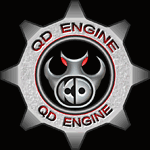

# QD Engine

(с) ООО "КД ВИЖЕН" (Калининград)

Весь код, за исключением сторонних библиотек, публикуется под лицензией GPLv3. Код сторонних библиотек (где указана иная лицензия) публикуется под лицензией этих библиотек.

Чат сообщества: https://t.me/kdlab_association_chat

## Структура:
- src/XLibs - библиотека XLibs
- src/QD - исходный код игры

## Работоспособность
Движок запускается с ресурсами из игры "Похождения бравого солдата Швейка" (1С, 2007 г.), однако работает нестабильно.

## Что потребуется
1. На текущий момент движок собирается для `Debug` конфигурации на Windows 10 + VS 2003 SP1.

## Пошаговая инструкция по сборке
1. В `src/XLibs` с правами администратора запустить `build.bat`
   1. Результат сборки будет расположен в `C:\XLibs`
1. Открыть в VS2003 `src\QD\Core\qdEngine.sln` выбрать проект `qdEngine` выбрать `Rebuild` это должно запустить последовательную сборку проектов `qdEngineCore` и `qdEngine`
   1. Результат сборки для `Debug` конфигурации в `src\QD\bin\dbg\qd_gameDBG.exe`

## Известные проблемы
1. Если будут возникать ошибки "Не хватает lib", то соберите соответствующие lib из xlibs
1. Если при сборке ругается на отсутствие `stlportd_static.5.0.lib `, то зайдите в `c:\XLibs\VC7.1\` и скопируйте `stlportd_static.5.1.lib` в `stlportd_static.5.0.lib`

## Ключевые изменения сделанные на текущий момент
1. Добавлен `class MpegSound` кроме того сам он модифицирован так чтобы убрать зависимость от `__int64 getRDTSC()`
2. Убрано использование `auto_ptr`
3. Исправлена несовместимость с `XZipArchive`
4. В `XLibs/Heap` добавлены отсутствующие, но необходимые заголовочные файлы, а также пара `.lib` файлов.
